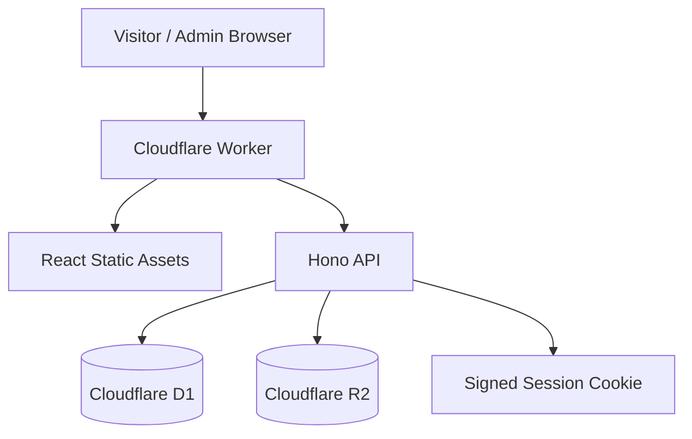

<small>

# DyeInk


> A production-ready, self-hosted blogging platform for Cloudflare Workers. DyeInk ships with a polished public blog, an admin dashboard, secure first-run setup, D1 persistence, R2 image storage, and one-click Cloudflare deployment.

<p align="center">
  <a href="https://deploy.workers.cloudflare.com/?url=https://github.com/subratamondal1/dyeink">
    
  </a>
</p>

<p align="center">
  <a href="LICENSE"></a>
  <a href="https://github.com/subratamondal1/dyeink/stargazers"></a>
</p>

---

## DyeInk

DyeInk is a full-stack blog system built for Cloudflare's edge runtime. The frontend is a React/Vite application and the backend is a Hono Worker that serves both the API and the built static assets.

It is designed to be deployed without a separate server. Cloudflare Workers serves the application, D1 stores content and settings, and R2 stores uploaded images.

## What You Get

- Public blog with search, pagination, post pages, view tracking, share tracking, optional newsletter modal, and configurable profile/social links.
- Admin setup flow that creates the first administrator on first run.
- Secure admin authentication with signed HttpOnly cookies, PBKDF2-SHA256 password hashing, strict password policy, and login rate limiting.
- Admin dashboard for published posts, editor workflow, site settings, stats, uploads, and subscriber data.
- Native rich-text editor using `contentEditable`, toolbar controls, sanitized HTML rendering, image upload, and image removal from editor content.
- Cloudflare D1 schema initialization on first API request, with migrations also kept in the repo for explicit database management.
- Cloudflare R2 image storage with optional public bucket URL support.
- Worker asset serving from one Cloudflare Worker deploy.

## Architecture



## Repository Layout

```txt
dyeink/
|-- backend/              # Hono Worker API
|   |-- migrations/       # D1 migration files
|   |-- src/              # Worker source
|   `-- wrangler.toml     # Backend-local Wrangler config
|-- platform/             # React/Vite frontend
|   |-- public/           # Static public assets
|   `-- src/              # Frontend source
|-- scripts/
|   `-- bundle-worker.mjs # Builds Pages-compatible _worker.js
|-- wrangler.toml         # Root Cloudflare Workers deploy config
`-- wrangler.pages.toml   # Optional Cloudflare Pages reference config
```

## Recommended Deploy

Use the Cloudflare deploy button:

<p align="center">
  <a href="https://deploy.workers.cloudflare.com/?url=https://github.com/subratamondal1/dyeink">
    
  </a>
</p>

Cloudflare should run:

```bash
npm run build
npx wrangler deploy
```

The root `wrangler.toml` is the Workers deploy config. It declares:

- Worker name: `dyeink`
- Static assets directory: `platform/dist`
- D1 binding: `DB`
- D1 database name: `dyeink`
- R2 binding: `IMAGES`
- R2 bucket name: `dyeink-images`

For Workers deploys, the config intentionally does not commit a D1 `database_id`. Wrangler can provision the declared resources during deployment. On the first API request, the Worker creates the required D1 tables and indexes if they are missing.

After deployment, open your site and complete the setup wizard. The password must contain at least 12 characters, including lowercase, uppercase, number, and special character.

## Cloudflare Pages Note

DyeInk is primarily configured for Cloudflare Workers. If you connect the repository as a Cloudflare Pages project, do not use `npx wrangler deploy` as the Pages deploy command.

For Pages, use:

```bash
npm run build
```

Build output:

```txt
platform/dist
```

Pages uses `platform/dist/_worker.js` as the server entrypoint. D1 and R2 must be created and bound in the Pages dashboard, or configured from a Pages-specific config based on `wrangler.pages.toml`. Replace the placeholder D1 `database_id` before using that file for Pages.

## Manual CLI Deploy

Install dependencies:

```bash
npm install
```

Build:

```bash
npm run build
```

Log in to Cloudflare:

```bash
npx wrangler login
```

Optionally seed the first admin password from a secret:

```bash
npx wrangler secret put APP_PASSWORD
```

Deploy from the repository root:

```bash
npx wrangler deploy
```

You can also deploy through the backend package:

```bash
npm run deploy
```

That command uses `backend/wrangler.toml`, builds the frontend first, and deploys the Worker with the built assets.

## GitHub Actions Deploy

The included workflow can provision D1/R2, apply migrations, and deploy to Cloudflare.

Required repository secrets:

- `CLOUDFLARE_API_TOKEN`
- `CLOUDFLARE_ACCOUNT_ID`

For the in-app custom-domain button, the token must include Workers Scripts Edit.
If the token cannot list zones, also set `CLOUDFLARE_ZONE_ID` and
`CLOUDFLARE_ZONE_NAME` in the deployed Worker variables.

Optional workflow input:

- `app_password` seeds the first admin password through `APP_PASSWORD`.

The workflow patches a temporary Wrangler config with the provisioned D1 database ID, applies migrations, and deploys the Worker.

## Local Development

Install dependencies:

```bash
npm install
```

Build the frontend once so the Worker has assets to serve:

```bash
npm run build
```

Start the Worker locally:

```bash
cd backend
npm run dev
```

The Worker runs on:

```txt
http://127.0.0.1:8787
```

For frontend-only development, run Vite:

```bash
cd platform
npm run dev
```

The Vite dev server proxies `/api` and `/img` requests to the local Worker.

Optional local D1 migration command:

```bash
npm run db:migrate:local
```

The Worker also initializes the schema automatically on first API request, so local migrations are useful for explicit database management but are not required for first-run setup.

## Environment Variables

No environment variable is required for the basic first-run setup.

Optional runtime variables:

- `APP_PASSWORD` seeds the first admin password when no admin exists.
- `R2_PUBLIC_URL` serves image URLs directly from a public R2/custom domain instead of proxying through `/img`.
- `FRONTEND_ORIGIN` controls the allowed CORS origin for API requests.

Optional frontend development variable:

- `VITE_API_BASE_URL` points the frontend at a remote API during Vite development.

## Cloudflare Services

### D1

The Worker expects a D1 binding named `DB`.

The schema includes admin, posts, site settings, subscribers, daily stats, and login-attempt tracking. The Worker creates these tables and indexes automatically when the API is first used.

Migrations are stored in `backend/migrations` for explicit schema management and CI deploys.

### R2

The Worker expects an R2 binding named `IMAGES`.

Uploaded images are stored in the `dyeink-images` bucket. If `R2_PUBLIC_URL` is set, image URLs use that public base URL. Otherwise images are served through the Worker at `/img/:key`.

## Stack

- Frontend: React 18, Vite 8, TypeScript, Tailwind CSS, shadcn/Radix UI, React Router, Zustand.
- Backend: Hono on Cloudflare Workers.
- Database: Cloudflare D1.
- Storage: Cloudflare R2.
- Authentication: PBKDF2-SHA256 password hashing, HMAC-signed HttpOnly cookies, login rate limiting.
- Editor: Native `contentEditable` rich-text editor with sanitized HTML output.
- UI extras: Recharts, Framer Motion, GSAP, Three/OGL.

## Security

- First-run setup is disabled after the first admin account exists.
- Admin passwords must meet a strong complexity policy.
- Passwords are hashed with PBKDF2-SHA256 using a Cloudflare Workers-compatible iteration count.
- Session cookies are signed, HttpOnly, Secure, SameSite Strict, and time-limited.
- Login attempts are rate limited per IP address.
- Public post content is sanitized before rendering.
- Server-side errors return generic JSON responses instead of exposing internals.

## Useful Commands

```bash
npm run build
npm run dev:worker
npm run dev:all
npm run deploy
npm run db:migrate
npm run db:migrate:local
npm audit
```

## Troubleshooting

### Setup fails after entering a password

Check that the deployed Worker has a valid D1 binding named `DB`. On Workers deploys, Wrangler can provision it from `wrangler.toml`. On Pages deploys, you must create and bind the D1 database in the Pages dashboard or use a Pages-specific config with a real `database_id`.

Also make sure the password satisfies the full policy: at least 12 characters with lowercase, uppercase, number, and special character.

### Wrangler says a Pages `_worker.js` file is being uploaded as an asset

That happens when using a Workers deploy with `platform/dist/_worker.js` present. The build script writes `platform/dist/.assetsignore` containing `_worker.js` so Workers Assets does not upload server-side code as a public asset. Re-run:

```bash
npm run build
```

Then deploy again.

### Wrangler says `database_id` is missing

For Workers, deploy with Wrangler 4 from the repository root so resource provisioning can create the D1 database declared in `wrangler.toml`.

For Pages, create the D1 database yourself and bind it to `DB`, or replace the placeholder in `wrangler.pages.toml` with the real D1 database ID before using that config.

## License

DyeInk is licensed under the GNU Affero General Public License v3.0. See [LICENSE](LICENSE).

</small>
