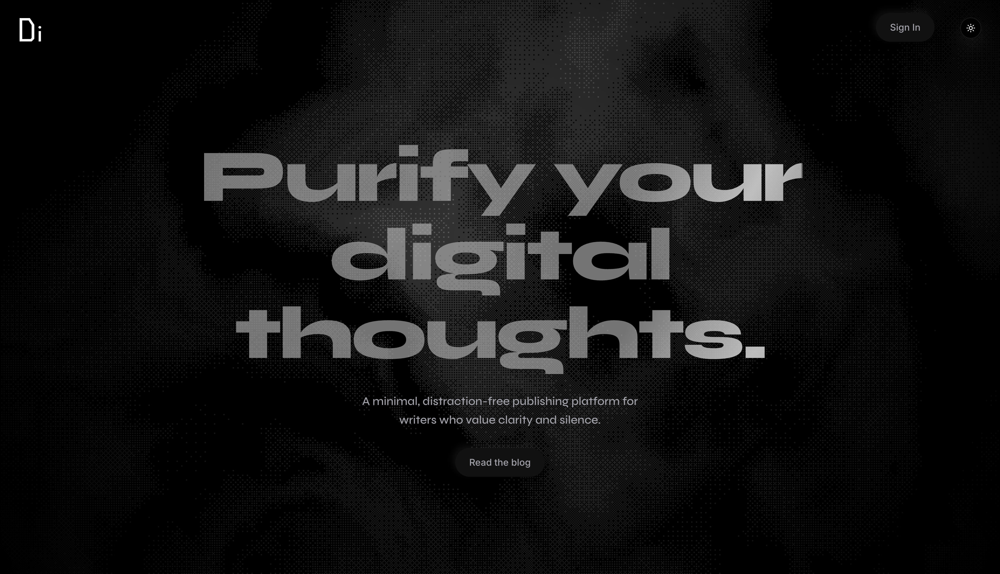
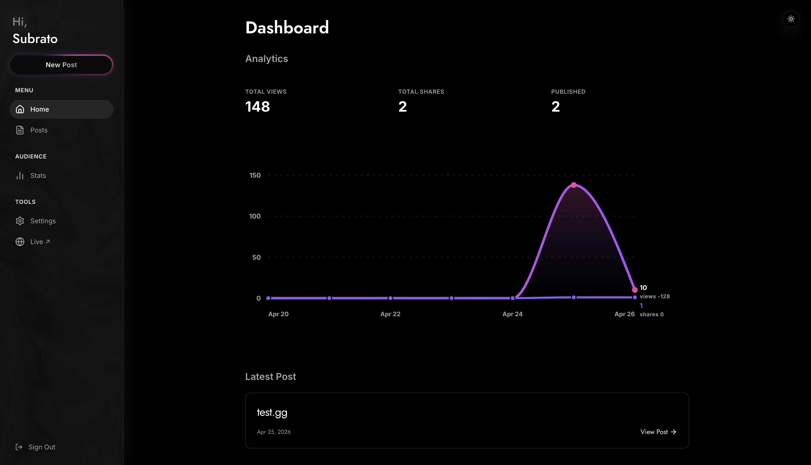
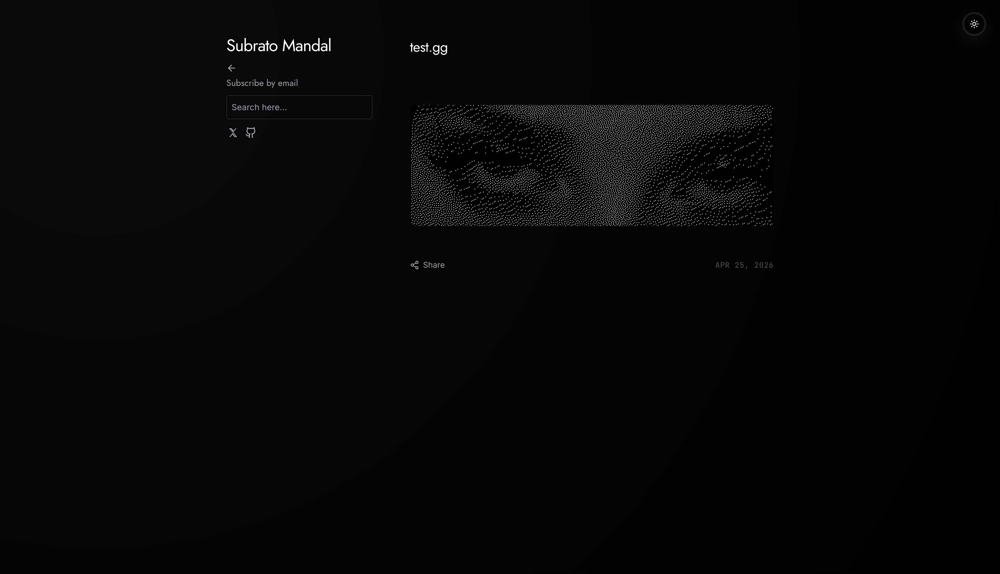
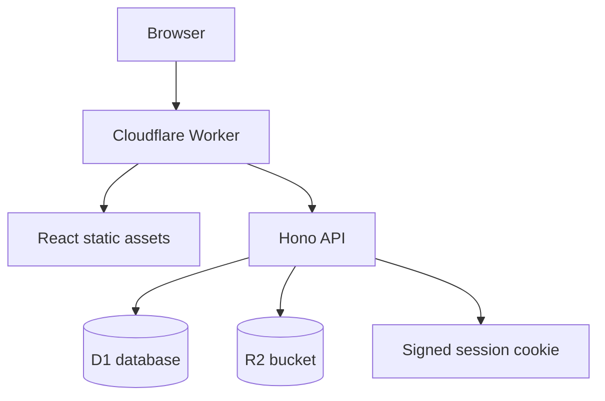

DyeInk is a single-admin blog for Cloudflare Workers. It uses D1 for data, R2 for uploads and public JSON artifacts, and a React/Vite app served from the same Worker.

<p align="center">
  <a href="https://deploy.workers.cloudflare.com/?url=https://github.com/subratomandal/dyeink">
    
  </a>
</p>

<p align="center">
  <a href="LICENSE"></a>
  <a href="https://github.com/subratomandal/dyeink/stargazers"></a>
</p>

## Screenshots







## Features

- Public blog with search, pagination, post pages, share tracking, view tracking, newsletter signup, and social links.
- Admin dashboard for posts, settings, stats, subscribers, image uploads, password changes, and custom-domain connection.
- Editor with rich-text mode, Markdown/source mode, image upload, sanitized rendering, GitHub-style Markdown, Mermaid, MathJax, and YouTube embeds.
- First-run setup wizard for creating the admin password.
- Signed HttpOnly session cookies, PBKDF2-SHA256 password hashing, and login rate limiting.
- D1 schema creation on first API request, with migrations kept in `backend/migrations`.
- R2-backed image storage and public JSON artifacts for the public blog.

## Architecture



## Repository

```txt
dyeink/
|-- backend/              # Hono Worker API
|   |-- migrations/       # D1 migrations
|   |-- src/              # Worker source
|   `-- wrangler.toml     # Backend-local deploy config
|-- platform/             # React/Vite frontend
|   |-- public/           # Static public assets
|   `-- src/              # Frontend source
|-- scripts/
|   `-- bundle-worker.mjs # Builds platform/dist/_worker.js for Pages
|-- wrangler.toml         # Root Workers deploy config
`-- wrangler.pages.toml   # Optional Pages binding reference
```

## Deploy

Use the deploy button above. Cloudflare will ask for D1 and R2 because `wrangler.toml` declares the `DB` and `IMAGES` bindings.

Use these values in the setup form:

| Field | Value |
| --- | --- |
| Project name | `dyeink` or your preferred name |
| D1 database binding | `DB` |
| D1 database name | `dyeink` |
| R2 bucket binding | `IMAGES` |
| R2 bucket name | `dyeink-images` |
| Build command | `npm run build` |
| Deploy command | `npx wrangler deploy` |
| Non-production branch deploy command | Leave blank |
| Path | Leave blank |
| API token | Let Cloudflare create it |

R2 must be enabled on the Cloudflare account. DyeInk uses it for uploaded images and generated public JSON files.

After deployment, open the Worker URL and complete the setup wizard. The admin password must be at least 12 characters and include lowercase, uppercase, number, and special character.

## Deploy Variables

For a normal deployment, leave optional values blank and keep the defaults shown here.

| Variable | Default | When to set it |
| --- | --- | --- |
| `APP_PASSWORD` | Blank | Seed the first admin password and skip the setup wizard. |
| `R2_PUBLIC_URL` | Blank | Serve images from a public/custom R2 domain instead of `/img/:key`. |
| `D1_HIT_ROLLUPS` | `on` | Set to `off` only if you do not want D1 view/share counters. |
| `FRONTEND_ORIGIN` | Blank | Lock API CORS to one origin. |
| `SITE_URL` | Blank | Base URL for newsletter links when no verified custom domain exists. |
| `EMAIL_FROM` | Blank | Enable newsletter email through Cloudflare Email Service. |
| `EMAIL_FROM_NAME` | `DyeInk` | Newsletter sender display name. |
| `CLOUDFLARE_API_TOKEN` | Blank | Enable in-app custom-domain automation. |
| `CLOUDFLARE_ACCOUNT_ID` | Blank | Required with `CLOUDFLARE_API_TOKEN`. |
| `CLOUDFLARE_ZONE_ID` | Blank | Fallback zone ID if the token cannot list zones. |
| `CLOUDFLARE_ZONE_NAME` | Blank | Fallback zone name if the token cannot list zones. |
| `CLOUDFLARE_WORKER_NAME` | `dyeink` | Set if the deployed Worker has a different service name. |
| `CLOUDFLARE_WORKER_ENVIRONMENT` | Blank | Use for environment-scoped Worker domain APIs. |
| `CUSTOM_DOMAIN_TARGET` | Blank | Override the DNS instruction target. |
| `VITE_API_BASE_URL` | `/api` | Change only for frontend dev against a remote API. |
| `VITE_PUBLIC_CONTENT_URL` | Blank | Serve public JSON artifacts from a separate origin. |

## CLI Deploy

```bash
npm install
npm run build
npx wrangler login
npx wrangler deploy
```

If Wrangler asks for resources, use:

- D1 binding: `DB`
- D1 database: `dyeink`
- R2 binding: `IMAGES`
- R2 bucket: `dyeink-images`

Optional first-admin password seed:

```bash
npx wrangler secret put APP_PASSWORD
```

## Cloudflare Pages

Workers is the primary deployment target. For a Pages project, use:

```bash
npm run build
```

Build output:

```txt
platform/dist
```

Pages uses `platform/dist/_worker.js` as the server entrypoint. Create and bind D1/R2 in the Pages dashboard, or use `wrangler.pages.toml` as a reference after replacing the placeholder D1 `database_id`.

## GitHub Actions

The workflow in `.github/workflows/deploy.yml` can create D1/R2, apply migrations, and deploy.

Required repository secrets:

- `CLOUDFLARE_API_TOKEN`
- `CLOUDFLARE_ACCOUNT_ID`

Optional workflow input:

- `app_password`

## Local Development

```bash
npm install
npm run build
cd backend
npm run dev
```

Worker URL:

```txt
http://127.0.0.1:8787
```

Frontend-only Vite dev:

```bash
cd platform
npm run dev
```

The Vite server proxies `/api` and `/img` to the local Worker.

Optional local migration:

```bash
npm run db:migrate:local
```

## Stack

- Frontend: React 18, Vite 8, TypeScript, Tailwind CSS, Radix UI, React Router.
- Backend: Hono on Cloudflare Workers.
- Database: Cloudflare D1.
- Storage: Cloudflare R2.
- State: native `useSyncExternalStore` stores.
- Rendering: DOMPurify, Marked, Mermaid, MathJax, D3 charting, custom canvas/WebGL effects.

## Security

- First-run setup is disabled after the admin account exists.
- Passwords require length and complexity checks.
- Password hashes use PBKDF2-SHA256.
- Sessions use signed HttpOnly, Secure, SameSite Strict cookies.
- Password changes rotate the session secret.
- Login attempts are rate limited by IP.
- Public post content is sanitized before rendering.
- Server errors return generic JSON responses.

## Commands

```bash
npm run build
npm run typecheck
npm run dev:worker
npm run dev:all
npm run deploy
npm run db:migrate
npm run db:migrate:local
npm audit
```

## Troubleshooting

### Cloudflare asks for many variables

Only D1 and R2 are required for a normal deploy. Leave optional variables blank unless you are enabling that feature.

### Setup fails

Check that the Worker has a D1 binding named `DB`. Also confirm the password satisfies the full policy.

### Uploads fail

Check that the Worker has an R2 binding named `IMAGES` and that R2 is enabled for the account.

### `_worker.js` is uploaded as an asset

Re-run:

```bash
npm run build
```

The build writes `platform/dist/.assetsignore` so Workers Assets does not publish the Pages Worker file as a static asset.

### `database_id` is missing

For Workers, deploy from the repository root with Wrangler 4 so Cloudflare can create or bind the D1 database declared in `wrangler.toml`.

For Pages, create the D1 database yourself and bind it to `DB`, or replace the placeholder in `wrangler.pages.toml`.

## License

DyeInk is licensed under the GNU Affero General Public License v3.0. See [LICENSE](LICENSE).
