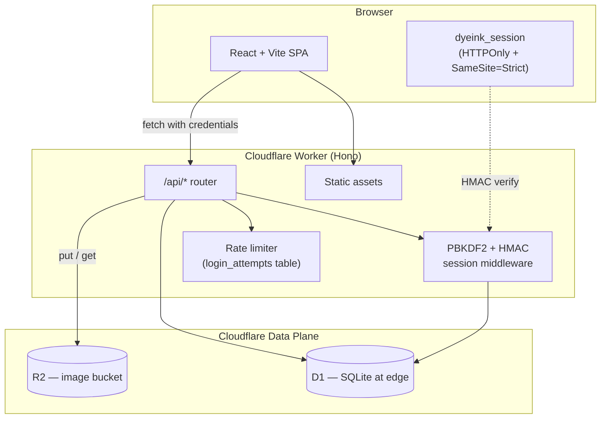

<small>

## DyeInk

A self-hostable, single-admin blog that runs entirely on Cloudflare. One click. One password. Yours.

[](https://deploy.workers.cloudflare.com/?url=https%3A%2F%2Fgithub.com%2Fsubratomandalme%2Fdyeink)
[](LICENSE)
[](https://github.com/subratomandalme/dyeink)

### Overview

Most blog platforms either lock you into a walled garden or hand you a Wordpress install that wants babysitting. DyeInk does neither: a React + shadcn frontend and a Hono Worker backend, deployed in a single click on Cloudflare's edge. Posts live in Cloudflare D1 (SQLite). Images live in Cloudflare R2. Auth is a single password. No external accounts to wire up.

What "single deploy" means here:

1. Click the Deploy to Cloudflare button
2. Cloudflare provisions D1, R2, the Worker, and the static SPA bundle in one go
3. Open your new `*.workers.dev` URL — the first visit walks you through choosing an admin password
4. You're writing posts within a minute

Supported deploy targets:

1. Cloudflare Workers + D1 + R2 (the recommended path — what the deploy button uses)
2. Cloudflare Pages + a separately-deployed Worker (if you prefer to split frontend / backend)
3. Local development against a local D1 with `wrangler dev`

### Architecture



### Security

1. Password Auth: One admin password, hashed with PBKDF2-SHA256 (600 000 iterations, OWASP 2023 spec)
2. Session Tokens: HMAC-SHA256 signed payloads in `HttpOnly`, `Secure`, `SameSite=Strict` cookies. No JWT libraries, no third-party identity provider
3. Rotating Server Secret: Each Worker stores its own random session-signing secret in D1. Changing the password rotates the secret and instantly invalidates all other sessions
4. Rate Limiting: 10 failed `/auth/login` attempts per IP in 15 minutes triggers a 429. Stored in a TTL'd D1 table
5. Constant-time Comparisons: PBKDF2 verify uses constant-time `xor` instead of `===` to defeat timing attacks
6. Static-host Discipline: The whole stack is served from one Worker at one origin, so cookies don't cross domains and CORS isn't a foot-gun
7. No External Vendors: Your password never leaves your Worker. There's no Auth0 tenant, no Atlas connection string, no third-party JWKS to trust
8. Strong Password Policy: Setup form requires 12+ chars with upper, lower, number, and a symbol. The Worker re-validates server-side

### Features

#### Writing

1. Distraction-free `contentEditable` editor with a floating toolbar
2. Rich-text primitives: headings, lists, blockquotes, code, links, alignment
3. Drag-and-drop image upload, paste, right-click delete
4. Autosave indicator and one-click Publish
5. Slug auto-generated from title; uniqueness enforced server-side

#### Reading

1. Public landing with searchable post index and pagination
2. Single-post view with view + share counters tracked per-day
3. Cover images served from R2 (custom domain or `r2.dev`)
4. Quill output rendered through DOMPurify
5. Optional newsletter subscribe modal, scoped to your blog

#### Admin

1. Dashboard with 7-day views/shares chart (Recharts)
2. Posts list with delete confirmations
3. Stats split by Traffic / Sharing
4. Settings: site name, tagline, author info, social links, newsletter toggle, password rotation
5. Sidebar collapses to icons under 640 px

#### Design

1. shadcn/ui + Tailwind CSS throughout
2. Dark default + matched light theme; toggle persists per-device
3. Decorative shaders (light rays, decrypted text, magic-button gradients) preserved
4. System font stack: Inter / Syne / Jost / Newsreader / JetBrains Mono / Mochiy Pop One
5. Responsive from 320 px up

#### Keyboard Shortcuts

1. `Tab` inside editor: insert literal tab into content
2. `Enter` inside link modal: submit
3. `Escape`: close any open modal or dialog
4. Right-click an inline image: delete it
5. `Cmd+K` / `Ctrl+K` (planned)

### Deployment

#### Cloudflare (one-click)

[](https://deploy.workers.cloudflare.com/?url=https%3A%2F%2Fgithub.com%2Fsubratomandalme%2Fdyeink)

1. Click the button. Cloudflare clones the repo into your account
2. Cloudflare reads `backend/wrangler.toml`, runs the `[build]` step which builds the SPA, then uploads the Worker
3. D1 (`dyeink`) and R2 (`dyeink-images`) are auto-provisioned the first time
4. Open the generated `https://dyeink.<account>.workers.dev` URL
5. The setup form prompts you for an admin password (12+ chars, mixed case, number, symbol)
6. You're in — head to the dashboard and start writing

#### Cloudflare (manual via CLI)

```bash
git clone https://github.com/subratomandalme/dyeink.git
cd dyeink

# 1. Install everything
cd platform && npm install --legacy-peer-deps && cd ..
cd backend && npm install && cd ..

# 2. Provision D1 + R2 (one-time)
cd backend
npx wrangler login
npx wrangler d1 create dyeink
# Paste the database_id into wrangler.toml where it says __REPLACE_ON_FIRST_DEPLOY__
npx wrangler r2 bucket create dyeink-images
npx wrangler d1 migrations apply dyeink --remote

# 3. Optional: skip the setup wizard by seeding the password as a secret
npx wrangler secret put APP_PASSWORD

# 4. Deploy
npm run deploy
```

#### GitHub Actions (auto-deploy on push)

The repo includes `.github/workflows/deploy.yml`. To enable:

1. Fork the repo
2. Settings → Secrets and variables → Actions → add:
   1. `CLOUDFLARE_API_TOKEN` (with Workers, D1, R2 edit permissions)
   2. `CLOUDFLARE_ACCOUNT_ID`
3. Push to `main` — the workflow provisions D1/R2 if missing, applies migrations, builds, and deploys
4. To trigger manually with a password seed: Actions → "Deploy to Cloudflare" → Run workflow → enter `app_password`

#### Local Development

```bash
# Frontend on :5173 (Vite proxies /api to the worker)
cd platform && npm run dev

# Worker on :8787 (in a second shell)
cd backend
npx wrangler d1 migrations apply dyeink --local
npm run dev
```

For the Vite proxy to land on the Worker, edit `platform/vite.config.ts`'s `server.proxy` target to `http://localhost:8787`. (Default points to `:3000`, a holdover from the old Fastify setup.)

### Environment Variables

There are *no required* secrets for the Worker — D1 holds the admin password and the session secret. Optional:

1. `APP_PASSWORD` (optional, secret): If set on first deploy, seeds the admin row directly. If absent, the SPA shows a setup form instead. Either path is supported
2. `R2_PUBLIC_URL` (optional, secret): If you've attached a custom domain to your R2 bucket, set this so uploaded images return that URL. If unset, images are served back through the Worker at `/img/<key>`
3. `FRONTEND_ORIGIN` (optional, secret): Pin CORS to a specific origin. Default mirrors the request origin

D1 + R2 binding names live in `backend/wrangler.toml` and are not env vars — `wrangler` reads them directly.

### Service Setup Guide

#### Cloudflare D1 (auto)

1. The `[[d1_databases]]` block in `wrangler.toml` declares a database named `dyeink`
2. The Deploy button or `wrangler d1 create dyeink` provisions it
3. Migrations under `backend/migrations/` run automatically via `wrangler d1 migrations apply`
4. Free tier covers 5 GB and 5 M reads/day per account

#### Cloudflare R2 (auto)

1. The `[[r2_buckets]]` block declares `dyeink-images`
2. The Deploy button or `wrangler r2 bucket create dyeink-images` provisions it
3. By default, uploaded images are served back through the Worker (`/img/<key>`) — fine for personal use
4. For a public R2 domain or custom domain, attach it in the R2 dashboard and set `R2_PUBLIC_URL` as a Worker secret
5. Free tier covers 10 GB storage + zero egress fees inside Cloudflare

#### Cloudflare Custom Domain (optional)

1. Cloudflare dashboard → Workers & Pages → your `dyeink` Worker → Settings → Domains & Routes
2. Click Add Custom Domain → enter your domain → Cloudflare creates the DNS records and the SSL cert automatically
3. No code changes needed; everything keeps working at the new origin

### Stack

1. Frontend: React 18, Vite, TypeScript, Tailwind CSS, shadcn/ui, Zustand, React Router
2. Backend: Hono on Cloudflare Workers, TypeScript
3. Database: Cloudflare D1 (SQLite at the edge)
4. Storage: Cloudflare R2 (S3-compatible, no egress fees)
5. Auth: PBKDF2-SHA256 password hash, HMAC-SHA256 session cookies, no third-party
6. Editor: Native `contentEditable` + `document.execCommand`, sanitised through DOMPurify
7. Charts: Recharts
8. Animations: Framer Motion, GSAP, Three.js shaders for the landing page only

### License

MIT — see [LICENSE](LICENSE).

Created by [@subratomandal](https://github.com/subratomandal)

</small>
